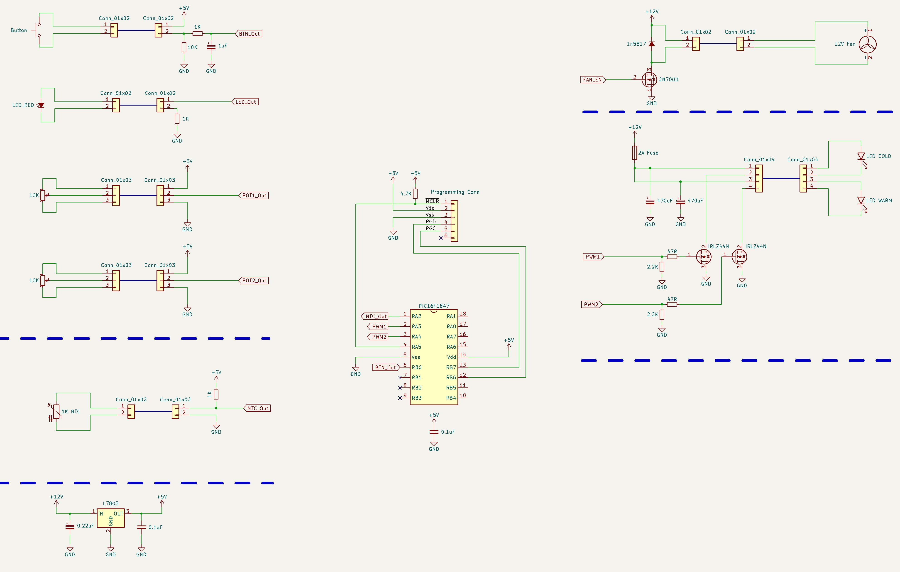
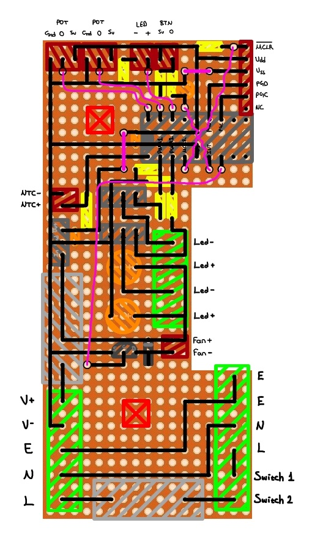

# Kelvin Ayrlı Stüdyo Işığı
C ile ve MPLAB kullanılarak yazılmış PIC16F1847 mikrodenetleyicisi ile oluşturulan kelvin ayarlı LED kontrol programı.

- Sıcak ve soğuk ışıklı LED lerin PWM ile çeşitli şiddetlerde karıştırarak farklı kelvin ayarları elde eder.

- Parlaklık ayarı kelvin ayarını etkilemez, kodu ona göre yazılmıştır.

- Ayarlar kilitlendikten sonra kapanıp açılsa bile EEPROM sayesinde ayarları yeniden yükler.

- Sıcaklık kontrol etmesi için soğutucuların içindeki NTC yi okur ve duruma göre fanı aktive eder, eğer sıcaklık belli bir
seviyeyi geçerse otomatik olarak LED leri kapatır. Histerezis kodun içinde bulunduğu için sürekli açma kapama gibi bir
sıkıntı yoktur.

- Fan ve sıcaklık kontrolü olduğu için, LED leri normalden daha yüksek voltajda çalıştırabilir.

# Devre Şemaları:

  
   

# Devre Resimleri:

  
   

# Proje Resimleri:

  
   
  

  
   
   
   

  
   
   
   

